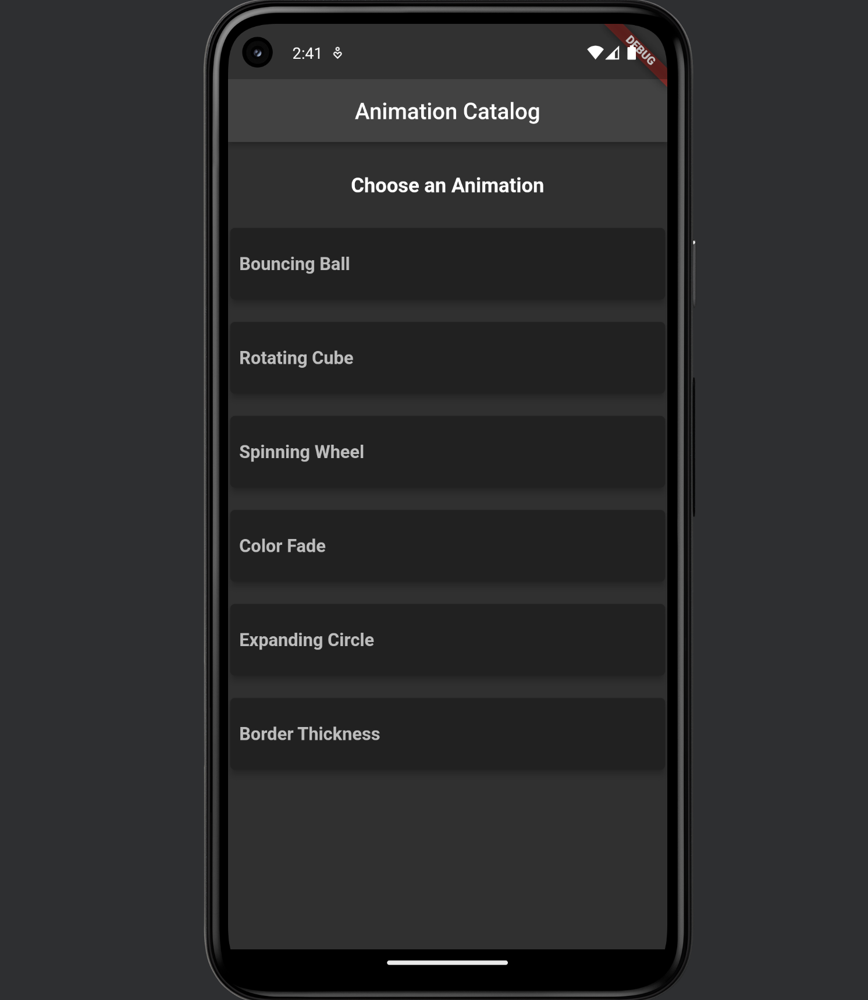
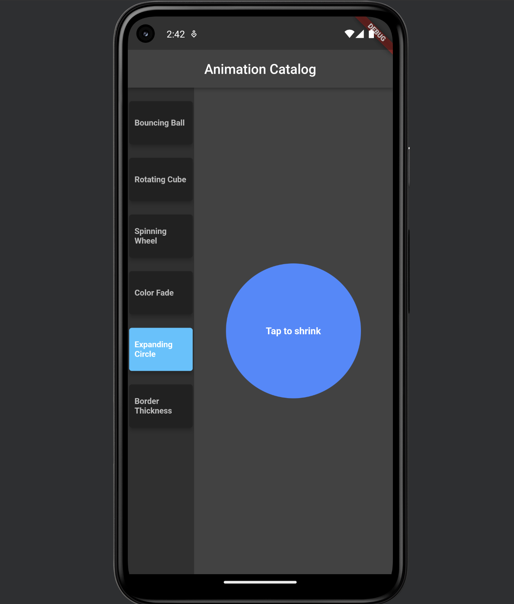
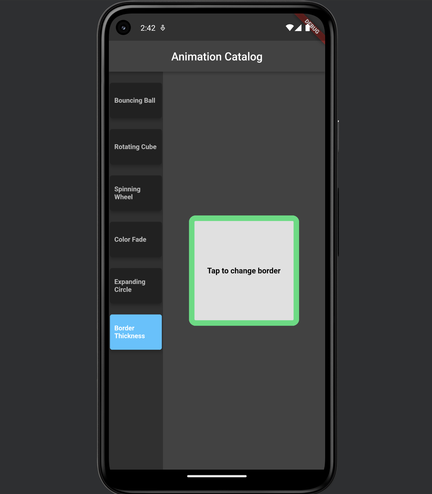
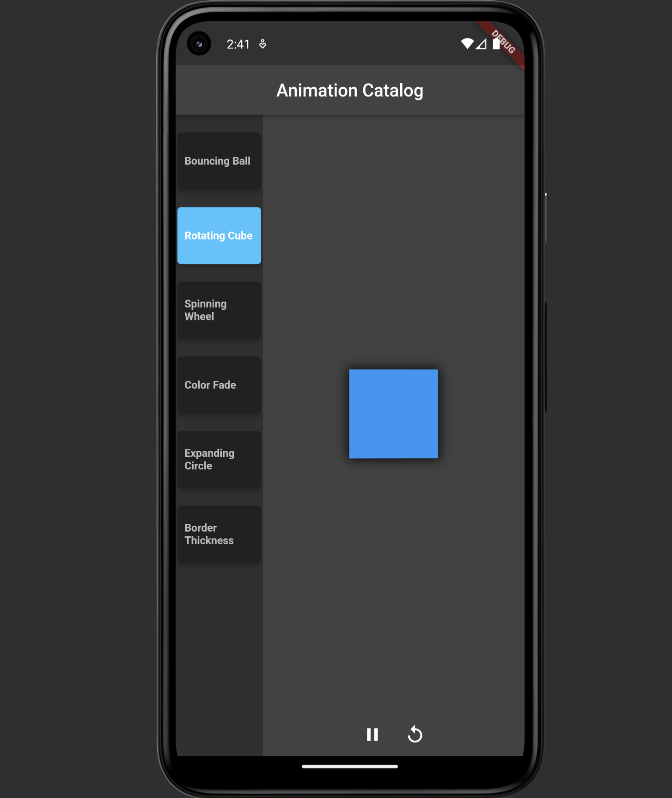
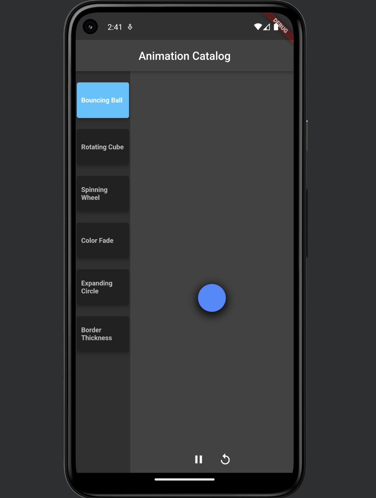
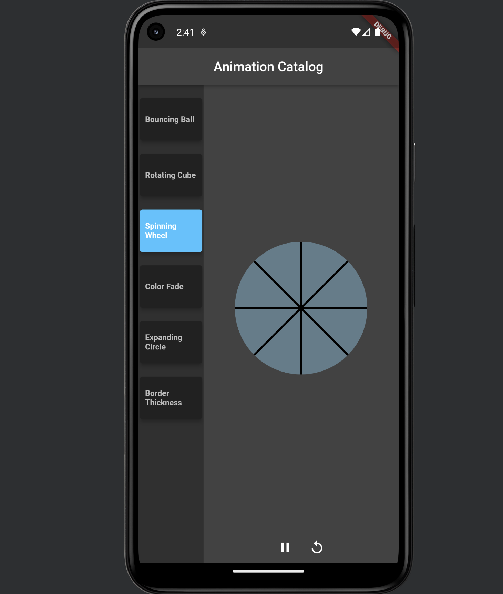
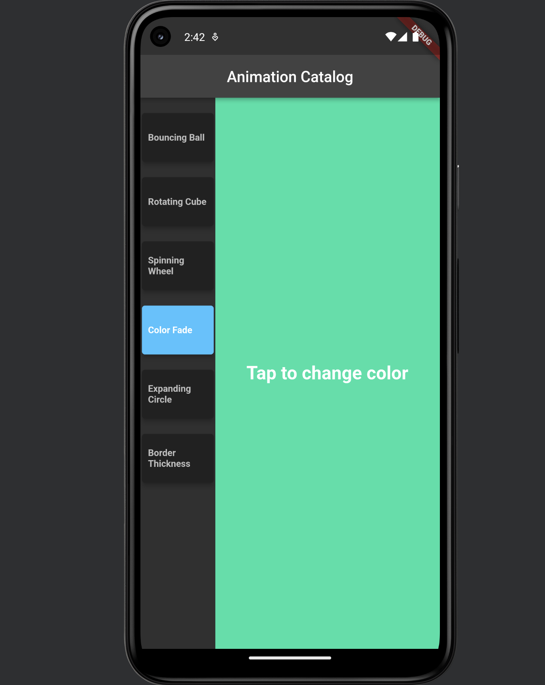

# Flutter Animation Catalog App

## Overview
The Flutter Animation Catalog App is a mobile application that simulates Android fragments, allowing users to choose from a catalog of animations. The app dynamically adjusts its layout to display the selected animation and includes both explicit and implicit animations, with features for interaction and control.

## Features
- **Dynamic Layout:** The app initially displays a full-width list of animations. Upon selection, the layout adjusts to a split-screen view with the list on the left and the animation on the right.
- **Explicit Animations:** Includes explicit animations with controls to pause, resume, and reverse, such as the Bouncing Ball and Rotating Cube animations.
- **Implicit Animations:** Features implicit animations like Color Fade and Expanding Circle, which respond to user interactions.
- **User Interaction:** Highlights the selected animation in the list and provides a responsive experience with smooth transitions.
- 
## Files Included

**Note:** The full Android Studio project is not included due to size constraints. You must use the provided files and import the code into your own Flutter project to run the app.

### `animation_display_widget.dart`
Defines the `AnimationDisplayWidget` class responsible for displaying the selected animation. It uses a switch-case structure to render the appropriate animation widget based on the user's choice.

### `animation_list_widget.dart`
Implements the `AnimationListWidget` class, which presents a list of animations for the user to choose from. It manages user selection and adjusts the layout based on the current state (full-width or split-screen).

### `border_thickness_and_color_change_animation.dart`
Contains the `BorderThicknessAndColorChangeAnimation` widget, which is an implicit animation that changes the thickness and color of a border. It uses `AnimatedContainer` and `GestureDetector` for smooth, interactive animations.

### `bouncing_ball_animation.dart`
Implements the `BouncingBallAnimation` widget, an explicit animation where a ball bounces within a bounded area. The animation includes controls for pausing, resuming, and reversing the direction of the bounce, using `AnimationController` and `Tween`.

### `color_fade_animation.dart`
Defines the `ColorFadeAnimation` widget, which smoothly transitions the background color between different shades upon user interaction. It uses `AnimatedContainer` and random color generation for dynamic color changes.

### `expanding_circle_animation.dart`
Implements the `ExpandingCircleAnimation` widget, where a circle expands and contracts based on user interaction. The animation utilizes `AnimatedContainer` to handle the resizing with smooth transitions.

### `main.dart`
The entry point of the Flutter application. It initializes the app and sets up the `HomeScreen` widget as the main screen. It defines the app’s theme and manages state for handling animation selection and layout adjustments.

### `rotating_cube_animation.dart`
Contains the `RotatingCubeAnimation` widget, an explicit 3D animation where a cube rotates around its Y-axis. The animation includes controls for pausing, resuming, and reversing the rotation, showcasing advanced use of `Transform` and `AnimationController`.

### `spinning_wheel_animation.dart`
Implements the `SpinningWheelAnimation` widget, an implicit animation that simulates a spinning wheel. The animation uses a custom painter to draw the wheel and `AnimationController` to control the rotation, with options to pause, resume, and reverse the spin.
## Screenshots

### Main Menu
- **Description:** Displays the main menu with a list of available animations.
- 

### Expanding Circle Animation
- **Description:** Shows the Expanding Circle Animation, where the circle grows and shrinks smoothly based on user interaction.
- 

### Border Thickness and Color Change Animation
- **Description:** Demonstrates the animation where the border's thickness and color change dynamically upon user interaction.
- 

### Rotating Cube Animation
- **Description:** Captures the Rotating Cube Animation, highlighting the 3D rotation around the Y-axis.
- 

### Bouncing Ball Animation
- **Description:** Displays the Bouncing Ball Animation at the peak of its bounce, showcasing the vertical motion.
- 

### Spinning Wheel Animation
- **Description:** Shows the Spinning Wheel Animation, focusing on the rotation of the wheel’s spokes.
- 

### Color Fade Animation
- **Description:** Illustrates the Color Fade Animation, where the background transitions smoothly between various colors.
- 

